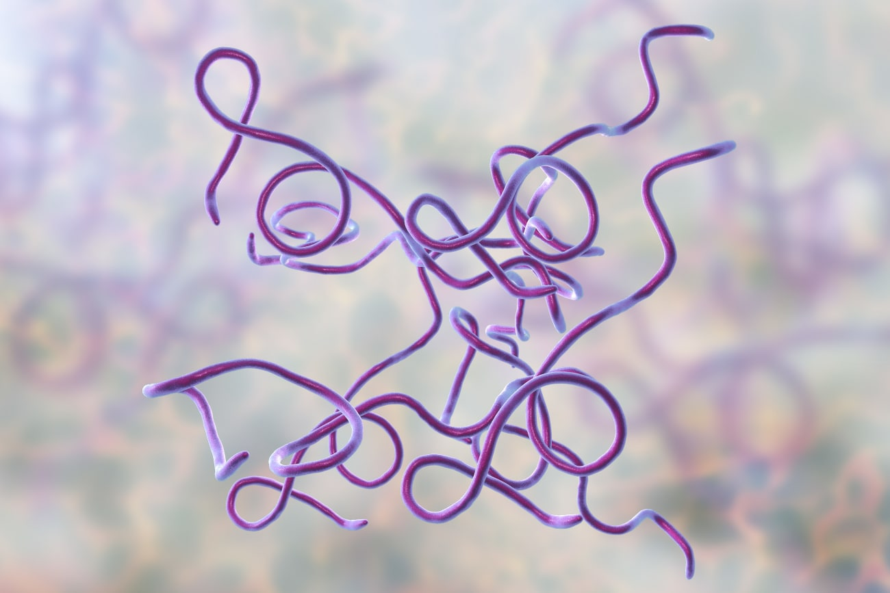

```{r setup, include=FALSE}
knitr::opts_chunk$set(echo = TRUE)
library(knitr)
Sequences <- read.csv("Sequences.csv")
```

# Anaylsis of the 16S gene sequence of B. Burgdorferi

```{r sequence_breakdown}


seq1 <- as.character(Sequences$Sequence[1])

seq1A <- gsub("C|T|G", "", seq1)
  seq1A <- nchar(seq1A, type = "chars")
seq1C <- gsub("A|T|G", "", seq1)
  seq1C <- nchar(seq1C, type = "chars")
seq1T <- gsub("C|A|G", "", seq1)
  seq1T <- nchar(seq1T, type = "chars")
seq1G <- gsub("C|T|A", "", seq1)
  seq1G <- nchar(seq1G, type = "chars")

HQ433692.1 <- c(seq1A,seq1C,seq1G,seq1T)  


seq2 <- as.character(Sequences$Sequence[2])

seq2A <- gsub("C|T|G", "", seq2)
  seq2A <- nchar(seq2A, type = "chars")
seq2C <- gsub("A|T|G", "", seq2)
  seq2C <- nchar(seq2C, type = "chars")
seq2T <- gsub("C|A|G", "", seq2)
  seq2T <- nchar(seq2T, type = "chars")
seq2G <- gsub("C|T|A", "", seq2)
  seq2G <- nchar(seq2G, type = "chars")

HQ433694.1 <- c(seq2A,seq2C,seq2G,seq2T)  


seq3 <- as.character(Sequences$Sequence[3])

seq3A <- gsub("C|T|G", "", seq3)
  seq3A <- nchar(seq3A, type = "chars")
seq3C <- gsub("A|T|G", "", seq3)
  seq3C <- nchar(seq3C, type = "chars")
seq3T <- gsub("C|A|G", "", seq3)
  seq3T <- nchar(seq3T, type = "chars")
seq3G <- gsub("C|T|A", "", seq3)
  seq3G <- nchar(seq3G, type = "chars")

HQ433691.1 <- c(seq3A,seq3C,seq3G,seq3T)

```


### Sequence HQ433692.1

```{r sequence_1, echo=FALSE}
print(seq1)
```

### Sequence HQ433694.1

```{r sequence_2, echo=FALSE}
print(seq2)
```

### Sequence HQ433691.1

```{r sequence_3, echo=FALSE}
print(seq3)
```


## Sequence nucleotide concentrations

```{r nucleotide_numbers}
Nucleotide <- c("A","C","T","G")

seq.nucleotides <- data.frame(Nucleotide,HQ433694.1, HQ433692.1, HQ433691.1)

kable(seq.nucleotides, 
      align = 'l',
      caption = "Amount of each nucleotide (ACTG) found in each of the three sequences for B. Burgdorferi")
```





## GC Concentrations

```{r GC concentration}
GCcon1 <- (seq1C+seq1G)/(seq1C+seq1G+seq1A+seq1T)
GCcon2 <- (seq2C+seq2G)/(seq2C+seq2G+seq2A+seq2T)
GCcon3 <- (seq3C+seq3G)/(seq3C+seq3G+seq3A+seq3T)
GC_Content <- c(GCcon1, GCcon2, GCcon3)
GC_Content <- sprintf("%1.2f%%", 100*GC_Content)
Sequence_IDs <- c("HQ433694.1","HQ433692.1","HQ433691.1")
conc <- data.frame(Sequence_IDs,GC_Content)
kable(conc, align = 'l',
      caption = "Concentration (%) of G and C nucleotides in each of the three sequences found for B. Burgdorferi")
```


# Part II 

```{r GC_Content, fig.cap= "Figure 1. Percentage of G and C Nucleotides (%GC) found in species A (Green), B (Red), and C (Blue). Points depict individual sequences as an integer connected to each Sequnece ID (Sequence #)"}

library(dplyr)
library(ggplot2)

GC_Content <- read.csv("GC_content.csv")
GC_Content <- mutate(GC_Content, GC = C + G)
GC_Content <- select(GC_Content, ID, Species, GC)

GC_Content$Sequence <- c(1:1000)
p1 <- qplot(GC, Sequence, data = GC_Content, 
      geom = c("point"),
      colour = Species,
      xlab = "% GC",
      ylab = "Sequence #",
      main = "GC Nucleotide Prcentage for Each Sequence")
p1 + scale_color_brewer(palette = "Dark2")
